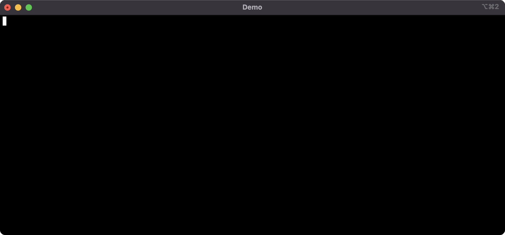

# Terra Compose Demo

This repository is created as a demo source of the [Terra Compose tool](https://github.com/demmonico/terra-compose) usage.

## Content

It contains different sub-projects in its structure within vary Terraform versions, naming patterns and workspaces. 
Besides that, there is an example of the aliases file, that is required for correct work of the [Terra Compose tool](https://github.com/demmonico/terra-compose).

**Note**: for simplicity and demo consistency it includes all Terraform states. But, for sure, for production usage it's **NOT RECOMMENDED**! 

## Installation

- follow the [Terra Compose tool's](https://github.com/demmonico/terra-compose#installation) installation steps
- since this example is based on AWS -> [setup AWS CLI access](https://github.com/demmonico/terra-compose#aws-credentials)
- `cd` to the root of your repo and create the configuration file `aliases.yaml` in the [following format](https://github.com/demmonico/terra-compose#configuration):
  ```yaml
  aliases:
    alias_name:                           # [allowed only A-Za-z0-9_ symbols]
      path: "path/to/project/base/dir"    # [required]
      workspace: "live"                   # [optional, "default" will be used if exists and no more choice OR ask]
      tfvars: "nonprod"                   # [optional, workspace name will be used if skip OR ask]
      tfversion: "x.x.x"                  # [optional, from the default section will be used if omitted]
  ```
- done!

## Demo run

Here are a few demos covering different aspects of `Terra Compose`'s usage.

### Demo screencast

**Note**: 
- **we need** to export AWS_PROFILE env var in order to let Terraform connect to AWS (for sure, only when you're using AWS)
- **we have** a good visibility on what project and workspace we are and which var files are we using
- **we have** a full transparency on what commands are we running
- **we do not depend** on the internal project's structure or it's path; alias handle that for us

#### Plan demo


#### Apply demo



#### Full demo


### Demo script

#### Demo installation

```shell
# for clear: 
# rm -rf tc /usr/local/bin/tc terra-compose-demo

wget https://raw.githubusercontent.com/demmonico/terra-compose/master/tc \
  && chmod +x tc \
  && ln -s ${PWD}/tc /usr/local/bin/tc

git clone https://github.com/demmonico/terra-compose-demo.git && cd terra-compose-demo

tc | grep -B 15 -A 3 '>>>'
```

#### Demo usage

Full 

```shell
echo "We must provide a \$AWS_PROFILE env variable" >/dev/null
export AWS_PROFILE=demmonico

aws ec2 describe-vpcs --region eu-central-1 --output text --query 'Vpcs[*].{VpcId:VpcId,Name:Tags[?Key==`Name`].Value|[0],CidrBlock:CidrBlock}' --no-cli-pager
aws ec2 describe-security-groups --region eu-central-1 --output text --query "SecurityGroups[*].[GroupName, VpcId]" --no-cli-pager

echo "Then we can run any Terraform command against any project we have" >/dev/null
echo "We can use a shortcuts for 'plan', 'apply' and 'workspaces'..." >/dev/null
tree common
tc workspaces common_STG
tc plan common_STG
echo "Or we can proxy calls via 'run' command..." >/dev/null
tc run common_STG state list
tc apply common_STG
tc run common_STG state list

tree projects/portal/platform
tc plan-debug portal_platform_INT
tc apply-debug portal_platform_INT

echo "Or we can have a full control over jumping into shell..." >/dev/null
tree environments/docs
tc shell docs
terraform workspace list
terraform plan
exit

aws ec2 describe-vpcs --region eu-central-1 --output text --query 'Vpcs[*].{VpcId:VpcId,Name:Tags[?Key==`Name`].Value|[0],CidrBlock:CidrBlock}' --no-cli-pager
aws ec2 describe-security-groups --region eu-central-1 --output text --query "SecurityGroups[*].[GroupName, VpcId]" --no-cli-pager

echo "For sure, we can check commands list and aliases using 'help' command..." >/dev/null
tc help
```

Short

```shell
export AWS_PROFILE=demmonico
aws ec2 describe-vpcs --region eu-central-1 --output text --query 'Vpcs[*].{VpcId:VpcId,Name:Tags[?Key==`Name`].Value|[0],CidrBlock:CidrBlock}' --no-cli-pager
tc workspaces common_STG
tc plan common_STG
tc apply common_STG
aws ec2 describe-vpcs --region eu-central-1 --output text --query 'Vpcs[*].{VpcId:VpcId,Name:Tags[?Key==`Name`].Value|[0],CidrBlock:CidrBlock}' --no-cli-pager

export AWS_PROFILE=demmonico
tc plan common_STG

tc apply common_STG
```


## Misc

Useful for development\presentation
```shell
# to clear: rm -rf ~/Documents/tc-install

ttyrec ~/Documents/tc-install
# OR ttyrec -a ~/Documents/tc-install
ttygif ~/Documents/tc-install -f
```

```shell
# loop over aliases
cat aliases.yaml | grep -E '^(\s)+[A-Za-z0-9_]+:(\s)*$' | sed -e 's/^[[:space:]]*//' | awk -F ":" '{print $1}'
for ws in $(cat aliases.yaml | grep -E '^(\s)+[A-Za-z0-9_]+:(\s)*$' | sed -e 's/^[[:space:]]*//' | awk -F ":" '{print $1}'); do tc plan $ws; done
```
